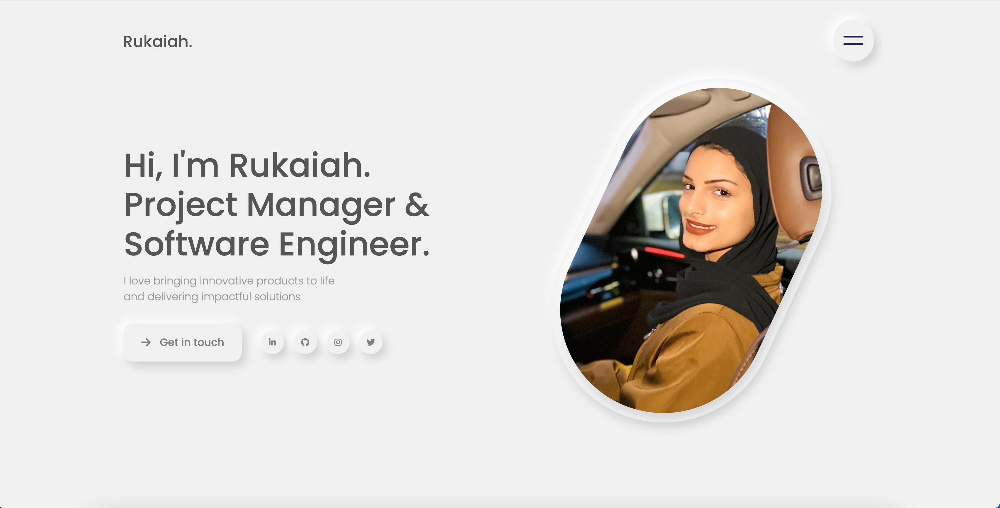

# Rukaiah's Portfolio Site
My personal website showcases my journey and experiences as a Project Manager and Software Engineer

## Preview

    

## Development
- **Template**: Started with a premium template from Webflow.
- **Customization**: Customized the template to better reflect my personal brand and professional experience.
- **Deployment**: Deployed using GitHub Pages and a service for the domain.

For a detailed walkthrough, check out my Medium post: [How I Built and Deployed My Portfolio Website in Just One Day](https://medium.com/@rukaiah/how-i-built-and-deployed-my-portfolio-website-in-just-one-day-a-quick-guide-for-developers-61d76f8e5a21)

## Connect with Me
Feel free to explore my website and connect with me through the provided contact options.